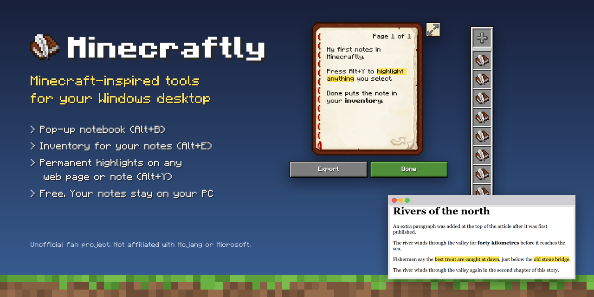
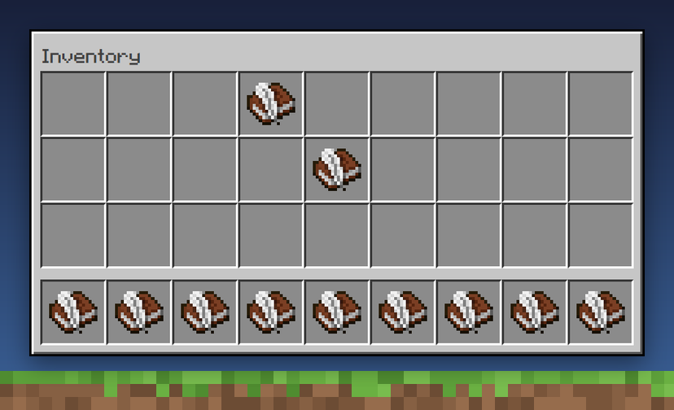
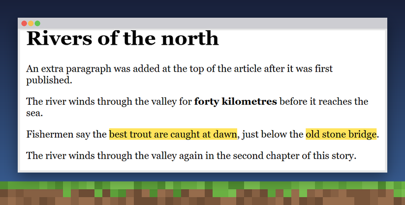

<p align="center"></p>

# Minecraftly

**Minecraft-inspired tools for your Windows desktop.** A little grass block sits in the corner of your screen. Click it, or press **Alt+E**, to open a hotbar and inventory full of your notes. Write in a pixel-art **Book & Quill** notebook, keep your to-dos on an **oak sign** in the top-right corner, and press **Alt+Y** to put a permanent yellow highlight on text in your notes or on any web page.

> **Unofficial fan project.** NOT AN OFFICIAL MINECRAFT PRODUCT. NOT APPROVED BY OR ASSOCIATED WITH MOJANG OR MICROSOFT.

[](https://github.com/sirwinstontea/Minecraftly/releases/latest/download/Minecraftly-Setup.exe)
[](https://github.com/sirwinstontea/Minecraftly/releases)

## Features

| | |
|---|---|
| **Pop-up notebook** (Alt+B) | Book & Quill: a pixel-art notebook with pages, bold and italic text, highlights, and export to PDF, Word (.docx) and Markdown. Exported files are named after what you wrote. |
| **Hotbar & inventory** (Alt+E) | Your notes sit in Minecraft-style slots. Hover to see a note's name, click to open it, drag to rearrange, right-click to rename or export, and drop a note outside the inventory to throw it away (Undo brings it back). |
| **Highlighter** (Alt+Y) | Select text and press Alt+Y. The highlight stays on that exact text every time you come back, even after small edits to the page. It works in Book & Quill and on websites in Chrome and Edge (with the free extension). |
| **To-do sign** (Alt+T) | An oak sign in the top-right corner for your to-dos: one line per to-do. It opens fully while you're on the desktop and shrinks to a little sign icon over other apps; click the icon to type. You can drag to reorder lines, move and resize the sign, and save a copy to your inventory. |
| **Always at hand** | The grass block in the corner opens it. It's hidden in screen recordings and steps aside for fullscreen games and videos. |
| **Private** | Notes and highlights stay on your PC. No account, no cloud. |
| **Auto-updates** | New versions install themselves in the background. |

<p align="center">
  
  
</p>

## Download

**[Download Minecraftly-Setup.exe](https://github.com/sirwinstontea/Minecraftly/releases/latest/download/Minecraftly-Setup.exe)** (Windows 10/11, 64-bit), then double-click it.

Or install from a terminal:

```powershell
$f = "$env:TEMP\Minecraftly-Setup.exe"; Invoke-WebRequest "https://github.com/sirwinstontea/Minecraftly/releases/latest/download/Minecraftly-Setup.exe" -OutFile $f; Start-Process $f
```

The installer isn't code-signed yet. If Windows shows **"Windows protected your PC"**, click **More info → Run anyway**.

### Browser highlighter

1. Download **[minecraftly-highlighter.zip](https://github.com/sirwinstontea/Minecraftly/releases/latest/download/minecraftly-highlighter.zip)** and unzip it.
2. Open `chrome://extensions` (or `edge://extensions`) and turn on **Developer mode**.
3. Click **Load unpacked** and pick the unzipped folder.

The extension needs the Minecraftly app running; it keeps your highlights there. A Chrome Web Store and Edge Add-ons listing is planned.

## Shortcuts

| Keys | What it does |
|---|---|
| **Alt+E** | Open the hotbar. Press again for the full inventory, and once more to close it. |
| **Alt+B** | Open the notebook |
| **Alt+Y** | Highlight the selected text, or remove the highlight under your cursor |
| **Alt+T** | Hide or show the to-do sign |
| **Alt+↑ / Alt+↓** | In the to-do sign, move the current line up or down |
| **1–9** | In the hotbar, open the note in that slot |
| **Q** | Throw away the note under the mouse |
| **Esc** | Close the open tool |

## FAQ

**Is this made by Mojang or Microsoft?** No. Minecraftly is an independent, unofficial project inspired by Minecraft's look.

**Where are my notes?** In `%APPDATA%\Minecraftly` on your PC. They're kept when you uninstall.

**I can't see the grass block or the tray icon.** Windows 11 hides new tray icons at first. Click the **^** next to the clock and drag the Minecraftly icon onto the taskbar. To bring back the grass block, right-click the tray icon and choose **Show grass block on screen**.

**Which apps can I highlight in?** Today: Book & Quill notes, and websites in Chrome and Edge with the extension. A PDF reader and support for Word, Firefox and other apps are on the [roadmap](docs/DEVELOPMENT.md#how-highlighting-works).

## Roadmap

- [x] Book & Quill notebook with PDF, DOCX and Markdown export
- [x] Hotbar and 36-slot inventory
- [x] Permanent highlights in notes and on web pages
- [x] Always-there to-do sign
- [ ] Minecraftly PDF reader with highlights
- [ ] Highlights in Word, Firefox and more apps
- [ ] More tools in the hotbar

## Contributing

Ideas and bug reports are welcome in [Issues](https://github.com/sirwinstontea/Minecraftly/issues). To run it from source, see [docs/DEVELOPMENT.md](docs/DEVELOPMENT.md).

---

<sub>Minecraftly is a fan-made project inspired by Minecraft. "Minecraft" is a trademark of Mojang Synergies AB. Minecraftly is not affiliated with, endorsed by, or sponsored by Mojang or Microsoft.</sub>
